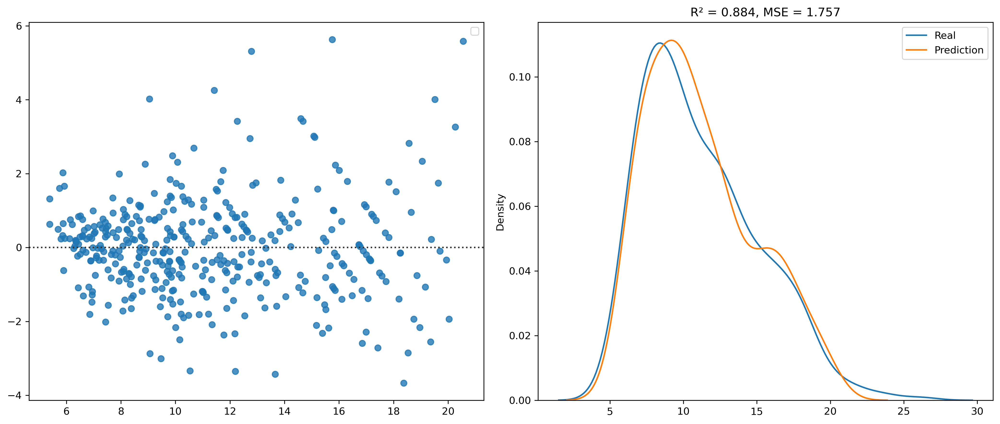
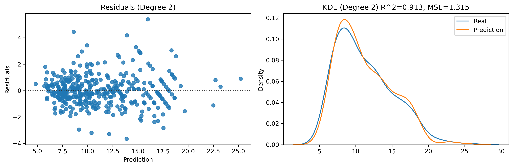
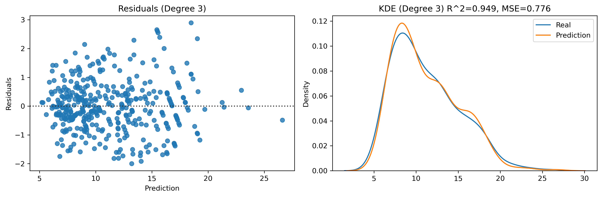
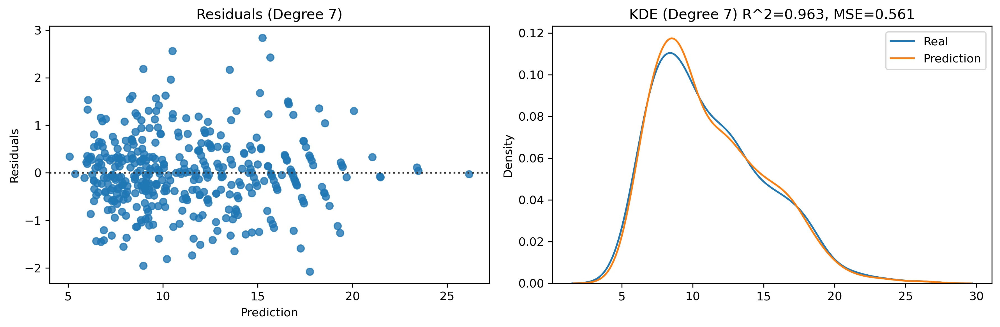
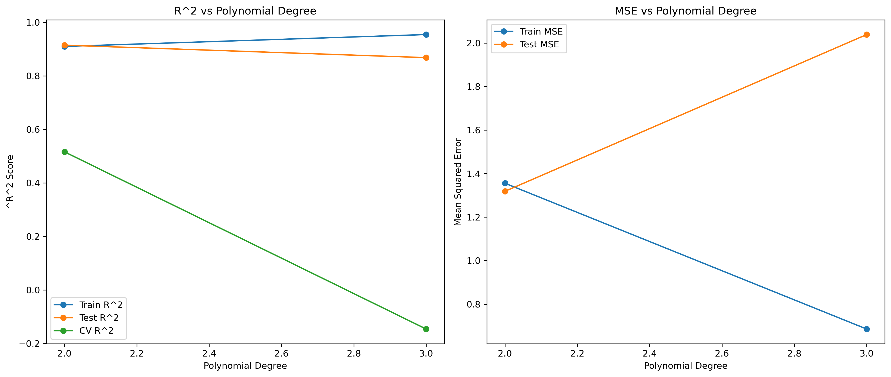
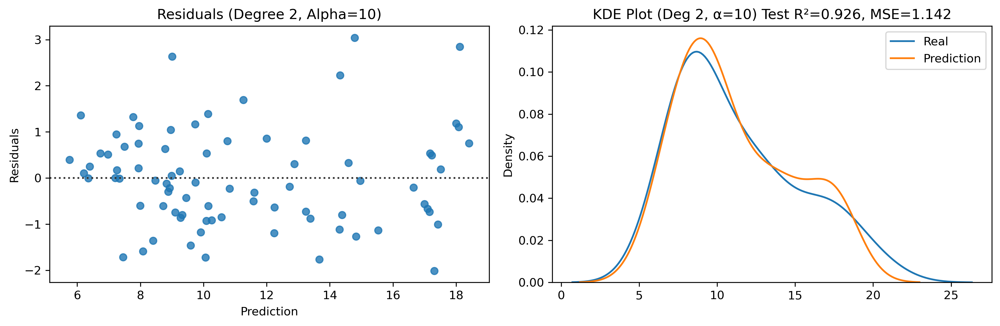
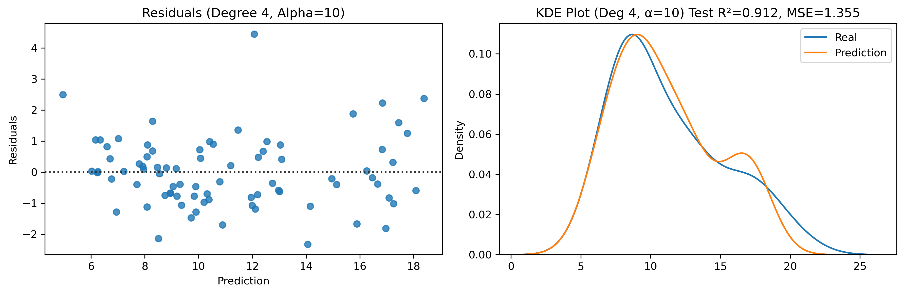
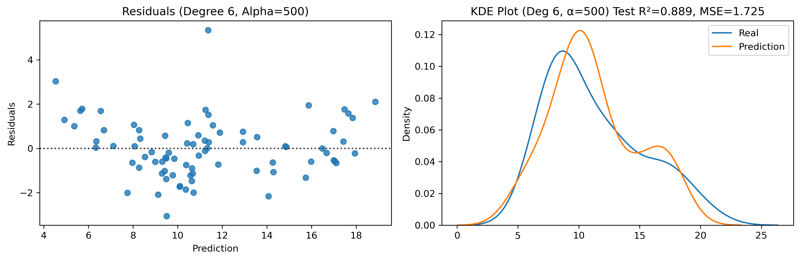

# 🚗 Fuel Consumption Prediction – Auto MPG Dataset

This is a **learning project** to explore real-world **data analysis with Python**.  
The goal was to practice using **Pandas, NumPy, Matplotlib, seaborn**, and **scikit-learn** on a real dataset by building and comparing different regression models.

---

## 🎯 What I wanted to learn

- How linear and non-linear regression models perform
- How to identify and reduce overfitting
- How to compare models using metrics like **R²** and **MSE**
- How to use **cross-validation** and **GridSearchCV** effectively
- How **regularization (Ridge)** improves generalization

---

## 🛠 Tech Stack

- Python
- Pandas & NumPy
- scikit-learn
- seaborn & Matplotlib

---

## 🔍 What I did

- Loaded and cleaned real fuel consumption data (data wrangling)
- Performed **exploratory data analysis (EDA)**
- Developed and compared regression models:
  - Basic Linear Regression
  - Polynomial Regression
  - Ridge Regression (with GridSearchCV)
- Evaluated models using **R²**, **MSE**, residual and KDE plots
- Used train/test splits and cross-validation to detect **overfitting**

---

## 📈 Model Development

### 1. Basic Linear Regression

First, I created a simple linear model to see how well it could predict fuel consumption.

- R²: 0.88
- MSE: 1.76

> [!NOTE]
> **R²** measures how well the model explains the variance (higher is better)
> **MSE** measures the average squared prediction error (lower is better)

The **residual plot** revealed a clear pattern, indicating that the linear model likely underfits the data.
The **KDE plot** also revealed a mismatch between predictions and actual values.

**Residual Analysis:**
In the residual plot a clear parabolic pattern is visible:
The residuals are mostly negative at the extremes and positive in the middle, forming an inverted U-shape. This indicates that the model systematically underestimates low and high values and overestimates mid-range values, which is a sign of underfitting and that the true relationship might be nonlinear. Also many predictions cluster around 6–10 l/100km, and there’s a visible lack of points in the outer regions of the plot.

---

### 2. Polynomial Regression

Based on the residuals, I tried polynomial models with increasing degrees.

| Degree | R² Score | MSE      |
|--------|----------|----------|
| 2      | 0.91     | 1.32     |
| 3      | 0.95     | 0.83     |
| 4      | 0.96     | 0.57     |
| 5      | **0.97** | **0.41** |

The model with degree 5 performed best on training data – but is likely **overfitted**.

The following plot shows how R² increases and MSE decreases up to degree 5:  

**Residual and KDE plots for degrees 2–7:**

**Residual Analysis:**: The residuals became narrower and more centered, subtle curved patterns still remain. Even though these models achieve much better R² and MSE values, the remaining structure in the residuals suggests that not all variance is fully captured, and some nonlinear effects or noise remain.

---

### 3. Overfitting Test with Cross-Validation

To test generalization, I used a train-test split (80/20) and applied **5-fold cross-validation**.

- **Train MSE** gets better with higher degree
- **Test MSE** and **CV R²** get worse beyond degree 2  
Clear sign of **overfitting from degree 3 onwards**

✅ Best polynomial model (with CV):
[LinearRegression + CV] degree 2 -> CV R² = 0.516 | test MSE = 1.32

---

### 4. Ridge Regression + Grid Search

To address overfitting, I applied **Ridge Regression** with **GridSearchCV**  
to find the best regularization strength `alpha`.

GridSearchCV tested various alpha values and selected the one that best balances bias and variance:  
[Ridge + GridSearchCV] degree 2 -> CV R² = 0.888 | test MSE = 1.14 | alpha = 10

This model generalizes better and reduces overfitting without sacrificing much accuracy.

**Residual Analysis:**  
Compared to the plain polynomial models, the residuals of the Ridge model show a much more random and homoscedastic distribution. There is no visible curved pattern, and the spread is fairly uniform across the range of predicted values. This indicates that Ridge regularization effectively reduced overfitting and led to better generalization, without significantly compromising accuracy.

📉 This is exactly what regularization is supposed to do:
Balance flexibility with generalization by shrinking coefficients and avoiding excessive curvature.

---

## ✅ Conclusion

Although Ridge Regression with α = 10 achieved a fit comparable to higher-degree polynomial models on the training data,
its **cross-validation R² score of 0.89** indicates that it is **less prone to overfitting** and therefore more reliable on **unseen data**.

**Best overall model:**
Ridge Regression (degree 2, α = 10) provided the best trade-off between accuracy and generalization –
combining strong predictive performance with improved robustness.
